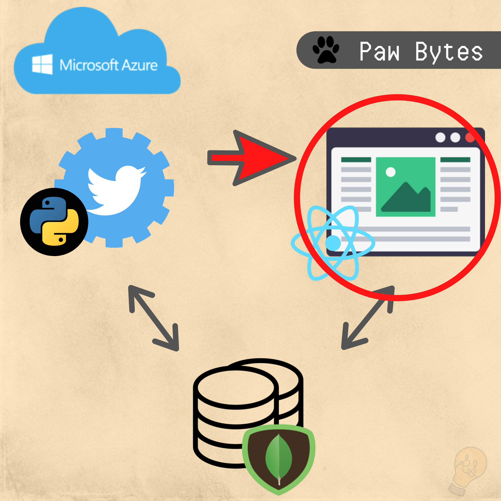

# Paw Bytes
Paw Bytes is a three part personal project which models a fictional restaurant.

The three components of this project are
 - [React Web Application](https://twitter.com/PawBytes)
 - [Twitter Bot](https://github.com/rocstory/PawBytes_PawBot)
 - [MongoDB Database](https://github.com/rocstory/PawBytes_PawBot)

Initially the project was intended to be a way of learning how to create a database from the ground up, however it turned into full stack three part project.

The goal of this project is to learn about managing a database, developing a web application using the React library, and working with Twitter's API and Python.

## Introduction 
Paw Bytes is a popular restaurant, home to many software engineers! Customers from all over come to enjoy many delicious entries as well as the company of our wonderful Paw Pals and Paw Associates.

Customers can also tweet at any of our Pawpals by tweeting at our restaurant's twitter profile with the hashtag of PawPals!

## Paw Bytes Web Application
The web application models the restaurant 'Paw Bytes'. 

## Project Documentation
Below are diagrams showing the structure of the web application.

To see all of Paw Bytes' documentation click the link below
[Documentation](https://twitter.com/PawBytes)

## Future implementation
- Integrate component animations
- Include a small web game involving the paw pets.

## Current Bug(s)
- When hosted on Netlify, the photo gallery and credits on the home page does not load on user's first visit.

## Challenges
- Learning react within the time frame and creating the application was a challenge within itself

## Collaborators
There are currently no collaborators on this project as of 8/5/2020

### Special Thanks
I want to give a big thanks to everyone who sent me photos of their pets!

